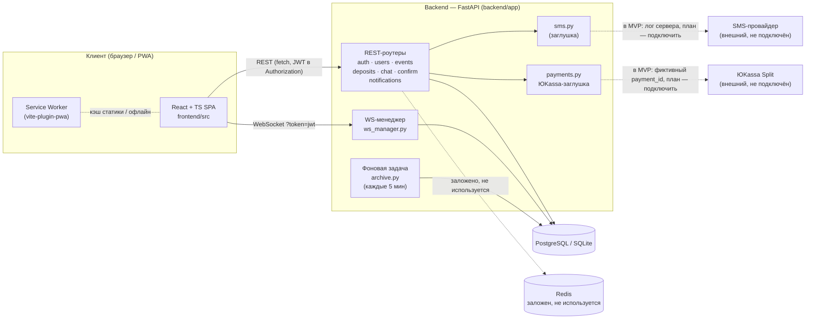
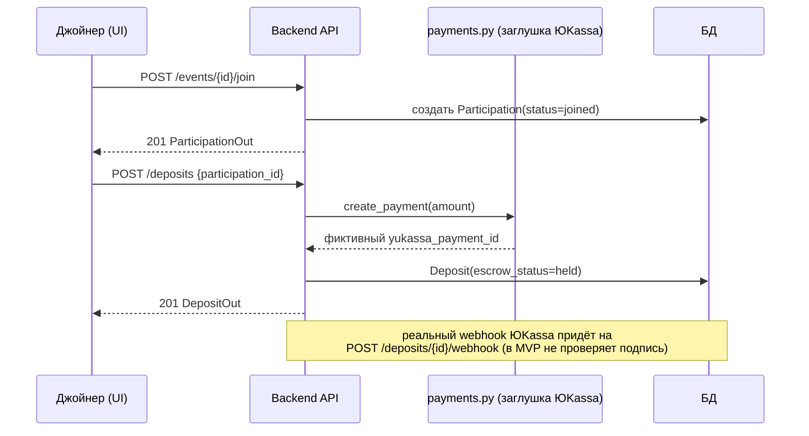
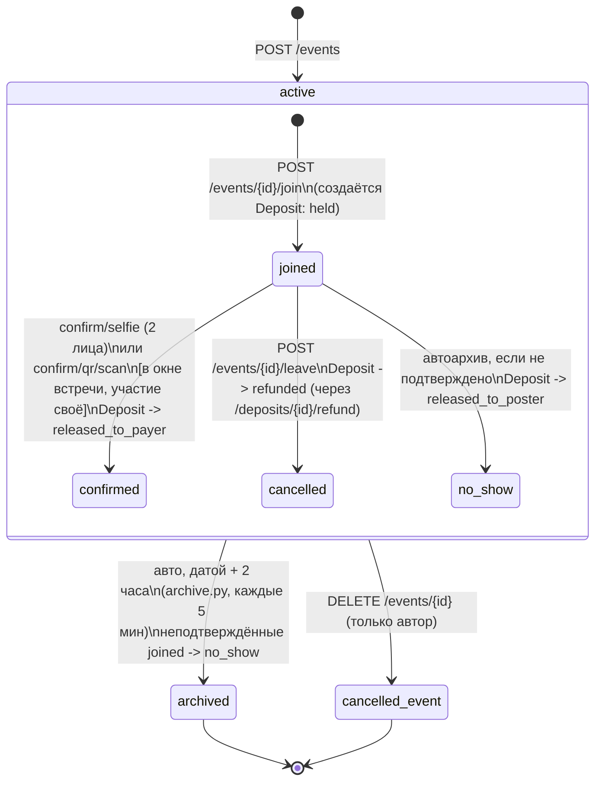
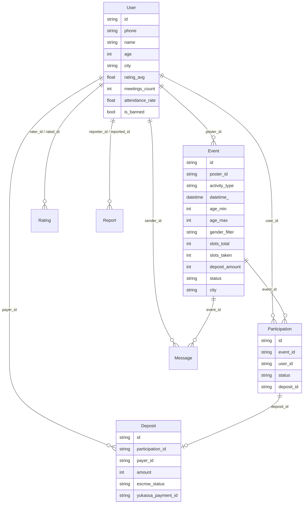

# ARCHITECTURE.md — «Вместе»

## 1. Обзор

MVP — классическое клиент-серверное приложение: React PWA обращается к REST/WebSocket
API FastAPI-бэкенда, который хранит данные в PostgreSQL (в Docker Compose) или SQLite
(локальная разработка по умолчанию). Redis заложен в инфраструктуру, но в MVP активно
не используется бизнес-логикой. Фоновая asyncio-задача внутри backend-процесса
периодически архивирует просроченные события.

Внешние интеграции (SMS-провайдер, ЮKassa Split) в MVP — контролируемые заглушки
(`backend/app/sms.py`, `backend/app/payments.py`), готовые к замене на реальные вызовы.

## 2. Компонентная диаграмма

## 3. Поток данных: присоединение к событию с депозитом

## 4. Стейт-машина события / участия / депозита

Ключевая бизнес-логика продукта — согласование трёх взаимосвязанных состояний:
`Event.status`, `Participation.status`, `Deposit.escrow_status`. Подтверждение
встречи рассчитывается **по каждому участнику отдельно** (`confirm.py::_settle_participation`),
а не разом на всё событие — это исправленная критическая проблема, ранее описанная в
`specs/REVIEW.md` (там же зафиксирован сам факт бага, для истории).

Депозит (`EscrowStatus`) — не отдельная стейт-машина события, а состояние, привязанное
к конкретному `Participation`: `held → released_to_payer` (подтверждена встреча) |
`held → released_to_poster` (no-show / автоархив) | `held → refunded` (участник вышел
до подтверждения через `POST /deposits/{id}/refund`).

## 5. Модель данных (сущности и связи)

## 6. Frontend-структура

`frontend/src/`:
- `screens/` — экраны по `specs/NAVIGATION.md` (AuthFlow, FeedScreen, EventDetailScreen,
  CreateEventWizard, ChatScreen, ConfirmMeetingScreen, RatingScreen, ProfileScreen,
  SettingsScreen)
- `components/` — переиспользуемые UI-компоненты (карточка события, TabBar и т.д.)
- `api/client.ts` — обёртка над `fetch`/WebSocket, сборка query-строки, обработка ошибок,
  подстановка JWT в заголовок, `chatSocketUrl` для WS
- `context/` — `AuthContext` (хранение токена, состояние пользователя)

## 7. Известные архитектурные ограничения (см. `specs/TEST_REPORT.md`, `specs/REVIEW.md`)

- `GET /deposits/{id}` не проверяет принадлежность депозита текущему пользователю.
- QR-токен подтверждения хранится в памяти процесса backend (`confirm.py: _qr_tokens`) —
  не переживёт рестарт/масштабирование на несколько инстансов; для прода нужен Redis с TTL.
- Alembic не подключён, схема создаётся через `Base.metadata.create_all`.
- Нет проверки на старте, что в проде не используется дефолтный `JWT_SECRET`.
- Фильтры `age_min/age_max/gender_filter` не применяются на `join` (только фильтр ленты).
