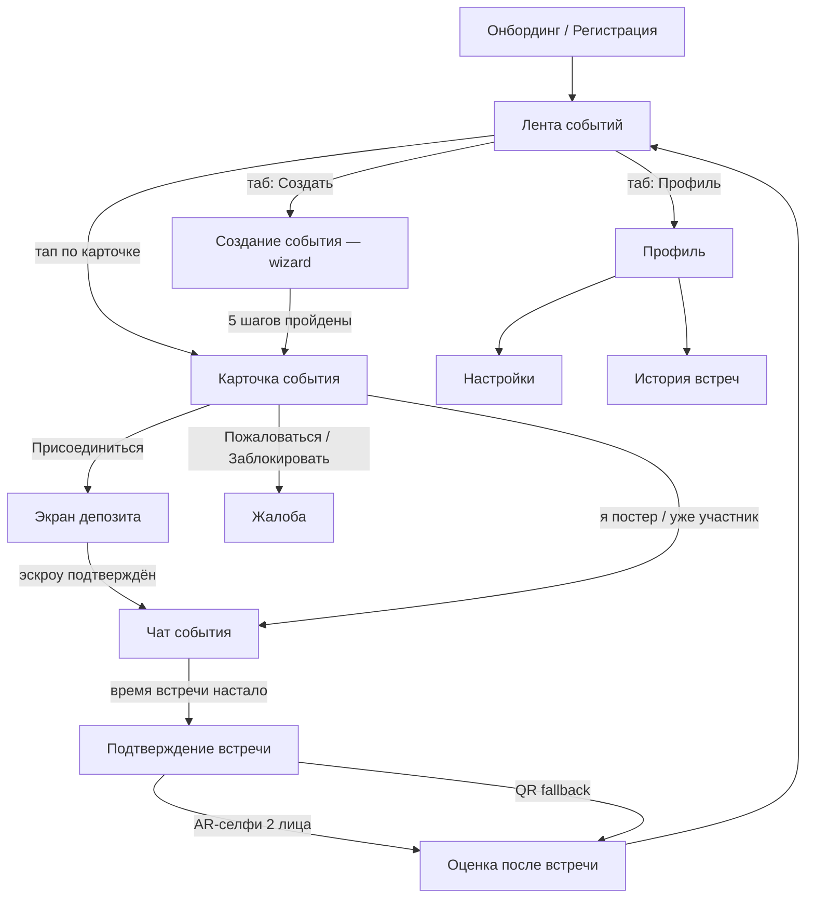
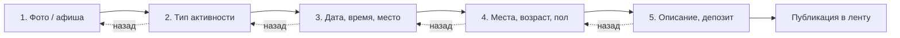
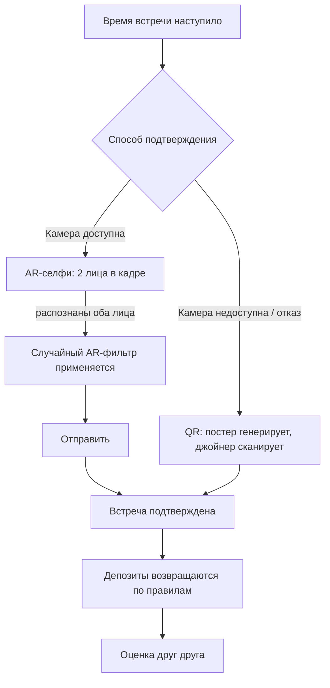
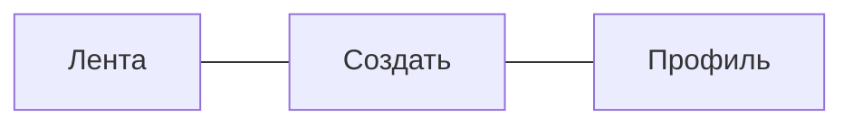

# NAVIGATION.md — «Вместе»

Навигация и переходы между экранами. См. также `specs/COMPONENTS.md`.

## 1. Общая карта экранов

## 2. Wizard создания события (5 шагов, сторис-стиль)

Свайп вправо/влево или кнопки "Назад" — как переключение сторис. Прогресс сохраняется при выходе (draft), кроме случая явной отмены.

## 3. Поток подтверждения встречи

## 4. Нижняя навигация (TabBar, мобильный)

На десктопе (≥1024px) — та же тройка в виде боковой панели, без изменений в логике переходов.

## 5. Модальные и вложенные экраны

- `DepositSheet` — bottom sheet поверх `Detail`, не отдельный роут
- `Report` — модальное окно поверх `Detail` или `Profile`
- `SmsCodeInput` — отдельный шаг внутри `Onboard`, не самостоятельный экран в истории навигации (back возвращает к вводу телефона)

## 6. Правила навигации

- Back-жест/кнопка всегда возвращает на предыдущий экран истории, кроме: `Confirm → Rating` (нельзя вернуться в подтверждение после оценки)
- `Chat` доступен только участникам события с `status: joined | confirmed`
- Попытка открыть `Confirm` до наступления времени события — редирект на `Chat` с подсказкой
- После `Rating` — редирект на `Feed`, не на `Detail` (событие уже архивируется через 2 часа)
